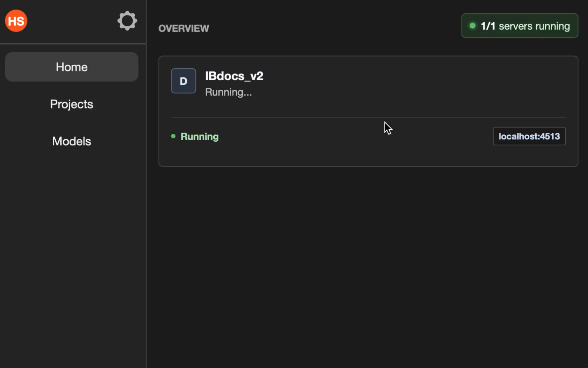
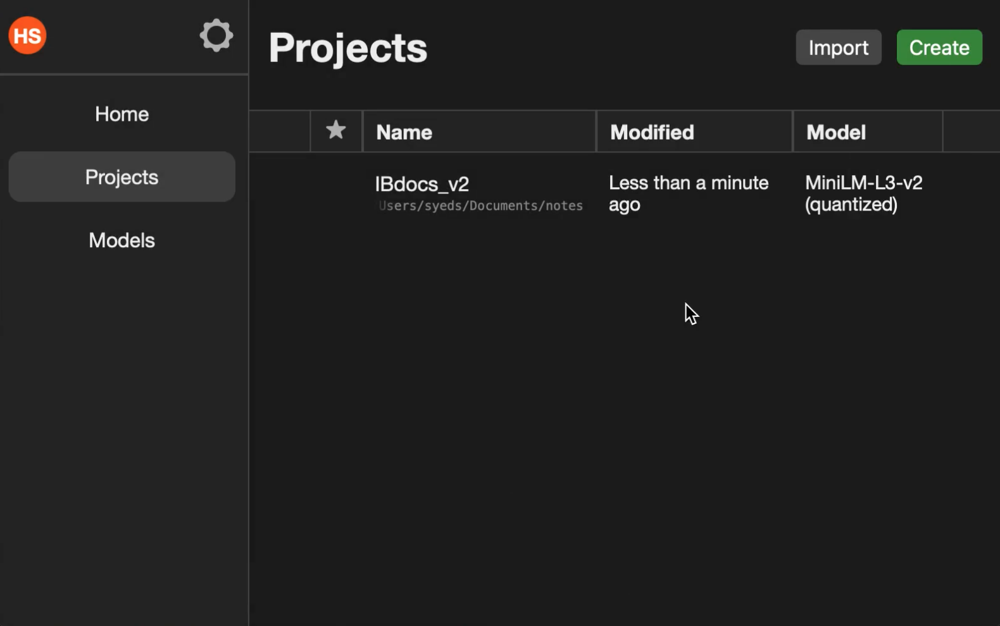
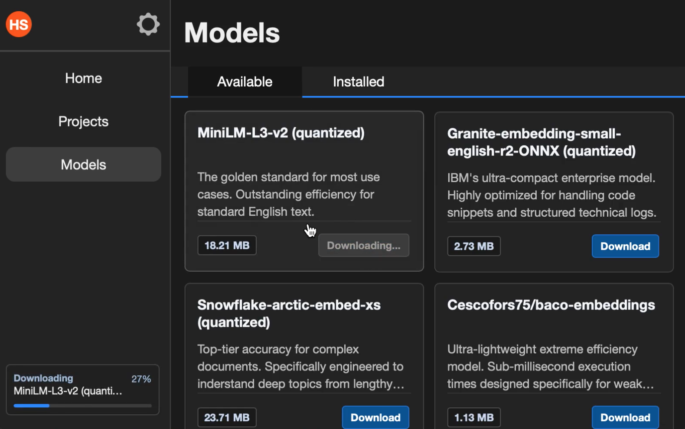
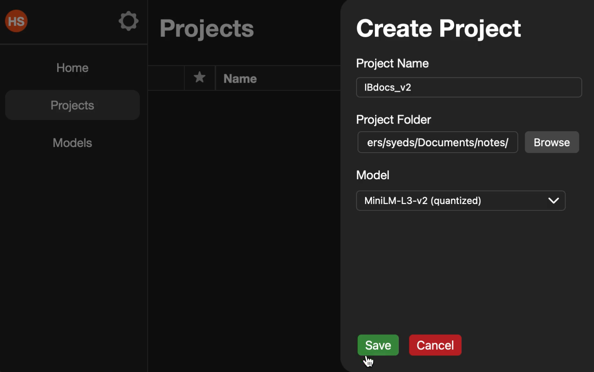

# MCP Creator
A simple app to create and host custom semantic search MCP servers.

**NOTICE: currently, only MacOS version 12 (Monterey) is tested, but it should work on (almost) every OS/arch**


## Intro
One of the main limitations with AI is its limited context window. While this is solved by **agentic RAG**, this is a problem to the average (non-technical) user.

> **Agentic RAG** is basically a way to search in a given knowledgebase via an MCP server (hence the name)
>
> The Algorithm user for this **semantic search** which means searching by meaning.
> Basically, searching for 'atom splitting' will be the same results as 'nuclear fussion'. While this may
> seem insignificant, it cuts token usage by a huge margin.
> Currently, mcp-creator can only index text and markdown files

Now that you know, it now seems obvious that it is extremely useful when searching large knowledgebases such
as internal wikis, class notes (my inspiration), obsidian vaults, etc. However, to create these servers requires a significant amount of technical knowledge and energy.

The aim of this project is to make it very simple to create these MCP servers on consumer-grade hardware and *especially* for non-technical people.


## How to use:
1) Go to the models page and download a model
2) Go to the projects page > create project
Select the model you downloaded and the folder you intend to share in the MCP server
3) Head over the the home page while wait for the project to index
4) Wait until it finishes indexing (This can take a while)
5) Connect it to whatever AI client you want
> Connection Details:
> 
> Transport: Streamable HTTP
> URL: Click the URL displayed under your project in the home page to copy it. Or just type it out manually

6) If you want to uninstall the app


## Settings page
If you click the gear icon, you will reach the settings page. Currently it only has 2 big buttons
1) "Open Storage Directory" --> opens the directory containing all stored files if you like to poke around
2) "Uninstall" --> deletes all saved data from disk and exits. Irreversible.

## Screenshots

### Home Page


### Projects Page


### Downloading Models


### Creating Projects



## The Journey
After my initial inspiration, I knew that I had to create a desktop app.

### One big decision
The first and formost important decision when making a project is to **chose the right frameworks**.
Either you do your research and find the ones with the best quality-to-effort ratio. OR... you do whats popular and then become a slave to what you chose.

I did my research and for me, my options were:
  - Electron (Way too much bloat)
  - Tauri (very efficient but learning rust is too hard)
  - NW.js (like tauri but with javascript. Although benchmarks show marginal difference from electron)

For me, nither option was right. I didn't like any of them. I went days researching more and more frameworks
but none met my criteria. But then, I found Wails. It was based exactly on what I was looking for. It was a nice vite (Vue for me) frontend with a `Golang` backend.

While I never used Golang before it is apparently fast (almost) like C, but high-level (almost) like python.
Additionally it's apparently one of the most simplest languages which made it very easy to learn.

#### I think I made the right decision


### One big problem
The problem with making a cross-platform desktop app is cross-platform compatability. This was especially a problem with the `onnxruntime_go` package. This package required having stored an external file, a compiled platform-specific binary. I went down a huge rabbit hole about how I now have to bundle the binary with the app and then write to disk on runtime. it was a huge mess.

Then I realized. Its an external file. I don't need to include it in the app. I could just download the file on runtime. I though this was it BUT NO. Apparently my computer (2015 Macbook) was too old and required an entire downgrade to the package that uses the file (hence the notice at the top).

#### I'll fix it later


## Tech Stack
  - Wails (Backend)
  - Node.js (Frontend)
  - Vite (Vue plugin. Frontend)


## Dependencies
If you want to develop the project on your local machine, you need:
  - [Golang](https://go.dev/dl/) (For Wails)
  - [Wails](https://wails.io/docs/gettingstarted/installation) (Backend)
  - [Node.js](https://nodejs.org/en/download) (Frontend)


## Local Development
1) clone the repo
```bash
git clone https://github.com/Nawab-AS/mcp-creator.git
cd ./mcp-creator
```

2) Run it
```bash
wails dev
```

Thats it! Amazing, am I right?


## AI disclosure
I used AI for researching, writing complex/confusing CSS rules (this includes cross-platform quirks), typescript types (i'm ok with typescript), and a good amount of backend golang (but less than 30%).